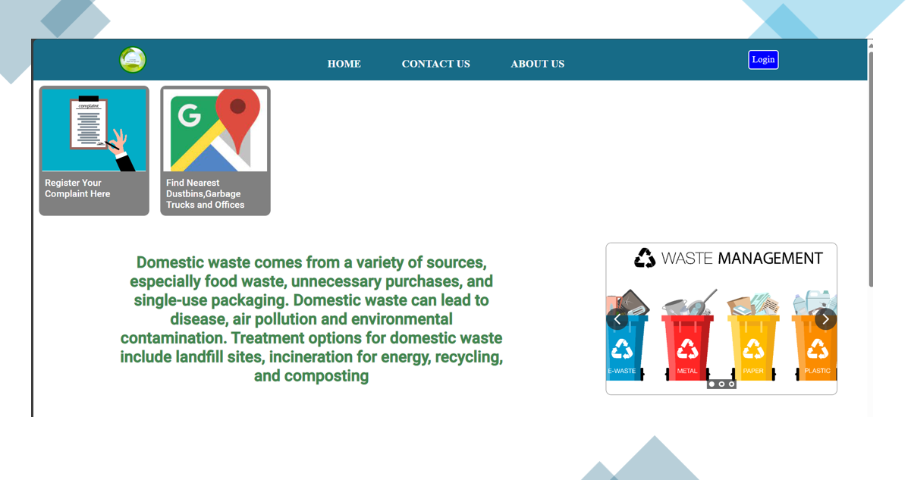
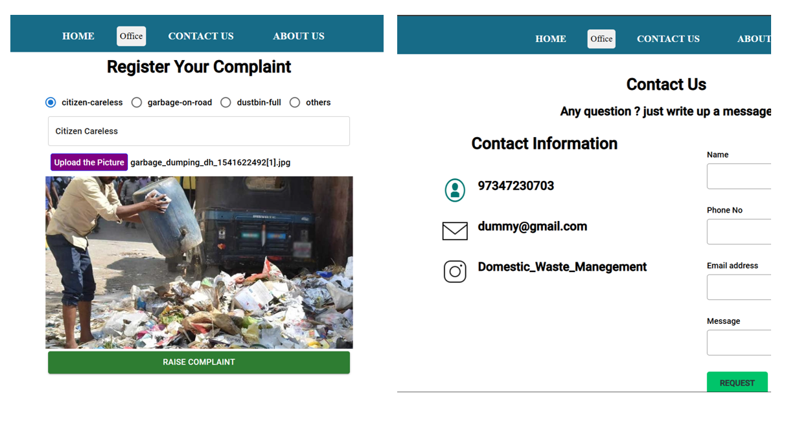
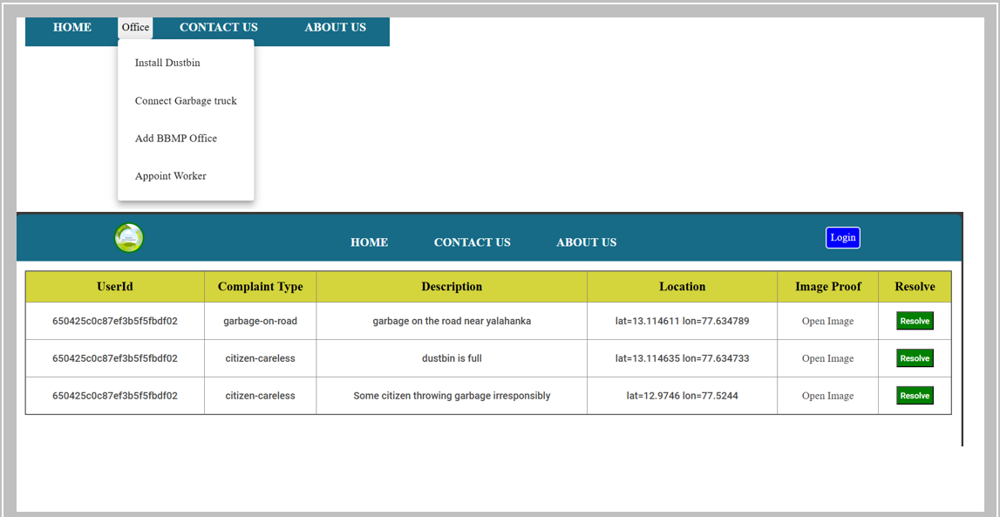
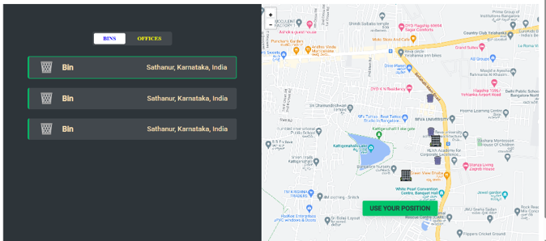

# Domestic Waste Management Project
- Project Code: SIIH1322
- Team Name: Solution Trackers
- Institute: Reva University
- Theme: Clean and Green Technology
- Team Leader: Pavan B N

## Introduction
The project aims to address the critical issue of domestic waste management in India by leveraging modern technologies such as the Internet of Things (IoT) and mobile applications. The primary goal is to create an efficient, responsible, and responsive waste disposal system that minimizes environmental impact and enhances public health.

## Problem Statement
India faces significant challenges in managing its waste, with overflowing landfills and improper disposal practices leading to severe environmental degradation and health risks. This project seeks to develop a comprehensive solution to ensure proper waste management and disposal.

## Key Components
#### Smart Bins:
- Functionality: Equipped with sensors to monitor the fill levels in real-time.
- Notifications: Automatically notify waste collectors when bins are almost full (90% capacity).
- Waste Sorting: Validate whether the waste is properly sorted into recyclable and non-recyclable categories, warning users if not.
#### Mobile Application:
- Complaint Management: Citizens can raise complaints about uncollected garbage or irresponsible disposal.
- Locator: Helps users find nearby collection trucks and company offices.
- Reporting: Allows users to report filled bins and request collection.
#### IoT Integration:
- Real-Time Monitoring: Continuously monitors the status of smart bins.
- Efficient Collection: Sends notifications to the nearest waste collectors and office to ensure timely disposal.
#### Reverse Vending Machines:
- Recycling Incentives: Collect plastic items and other recyclables, offering rewards based on weight to encourage recycling.
#### Awareness Campaigns:
- Education: Conduct live events to raise awareness about proper waste disposal and its benefits for the environment and public health.
# Preview

